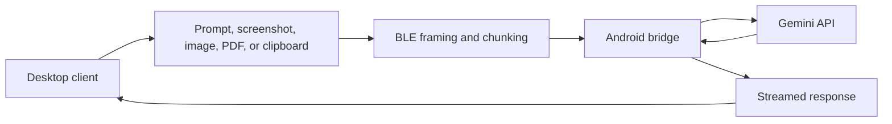

# Gemini AirBridge

**A Bluetooth Low Energy bridge that lets desktop clients use Gemini through an Android device.**

Gemini AirBridge is an experimental cross-platform AI workflow. An Android
phone runs the Gemini API client, while one or more desktop clients connect to
it over Bluetooth Low Energy and send prompts, screenshots, clipboard content,
images, PDFs, and local context.

The result is a lightweight desktop experience where the API key stays on the
phone, the desktop client remains simple, and AI requests can still work in
environments where a direct desktop-to-cloud workflow is inconvenient.

The repository is still named `bluetooth-gemini-chat` for compatibility with
release links and update checks, but the project is presented as Gemini
AirBridge.

## Why it exists

Most AI desktop clients assume that the computer should own the model
connection directly. Gemini AirBridge explores a different architecture:

- keep Gemini credentials isolated on an Android device
- use BLE as a local transport layer between desktop and phone
- support quick multimodal requests from the desktop without building a full
  cloud backend
- allow multiple desktops to share the same phone-side AI bridge
- keep the desktop UI small, local, and easy to run

This makes the project useful as a prototype for constrained networks,
privacy-conscious workflows, local-first AI tools, accessibility overlays, and
cross-device automation.

## What it solves

- **API-key isolation**: the Gemini key is configured on Android instead of
  being copied into every desktop environment.
- **Multimodal desktop input**: send screenshots, clipboard content, images,
  PDF context, and typed prompts through the same BLE channel.
- **Cross-platform clients**: run the desktop client on macOS, Windows, or
  Linux while the Android device acts as the AI bridge.
- **Multi-client routing**: several desktop clients can connect to the same
  phone, with responses streamed back to the correct requester.
- **Low-friction interaction**: global shortcuts, tray/menu bar behavior,
  overlays, reconnect logic, and model selection make the workflow usable
  during normal desktop work.

## Main capabilities

### Desktop client

- Python desktop app with a local chat interface
- BLE discovery, connection management, heartbeat, and auto-reconnect
- Prompt, screenshot, clipboard, image, and PDF submission
- Local PDF extraction and retrieval of relevant chunks
- Markdown rendering and progressive response streaming
- Multiple chats with persistent local history
- Global shortcuts for screenshot and clipboard workflows
- Overlay answers for quick, low-friction responses
- Tray/menu bar behavior on supported platforms
- GitHub release update checks and desktop packaging scripts

### Android bridge

- Kotlin Android app acting as the BLE server
- Gemini API integration and model discovery
- Foreground BLE service with wake-lock handling
- Multi-client request queueing and response routing
- Binary framing and chunk reassembly for larger payloads
- Support for multimodal prompts, web search options, thinking settings, and
  cancellation
- In-app settings, permissions, and update checks

## Technical foundation

- **Transport**: Bluetooth Low Energy GATT
- **Desktop**: Python, Bleak, Tkinter, Pillow, pypdf
- **Android**: Kotlin, Android foreground service, coroutines, OkHttp
- **AI**: Gemini API with streaming responses
- **Protocol**: custom binary framing, chunking, ping/pong heartbeat, and
  compressed prompt bundles
- **Packaging**: shell scripts and GitHub Actions for desktop bundles and
  Android APKs

## How the flow works



The phone owns the Gemini connection. The desktop owns the interaction layer.
BLE is the bridge between the two.

## Platforms

- macOS
- Windows
- Linux
- Android

The desktop client is cross-platform. The bridge server runs on Android.

## Quick start

### Desktop

```bash
./scripts/setup_desktop.sh
./scripts/run_desktop.sh
```

### Android

```bash
./scripts/build_android_apk.sh
./scripts/install_android_apk.sh
```

### First-time setup

1. Install and open the Android app.
2. Add a Gemini API key on the Android device.
3. Grant Bluetooth permissions and disable aggressive battery optimization if
   needed.
4. Open the desktop client.
5. Scan for the Android bridge, connect, and send a prompt.

## Useful paths

- Desktop app: `desktop/app.py`
- Desktop BLE client: `desktop/ble_client.py`
- Shared desktop protocol: `desktop/ble_protocol.py`
- Android BLE service:
  `android/GeminiBluetoothBridge/app/src/main/java/com/example/geminibridge/BleKeepAliveService.kt`
- Android Gemini client:
  `android/GeminiBluetoothBridge/app/src/main/java/com/example/geminibridge/GeminiApiClient.kt`
- BLE architecture note: `docs/mesh-evaluation.md`

## Practical notes

- API usage and billing depend on the Gemini API key configured on Android.
- macOS requires Bluetooth access; screenshot shortcuts may also require Screen
  Recording and Accessibility permissions.
- Some Android vendors, especially Xiaomi, MIUI, and HyperOS devices, may need
  battery optimization disabled for stable background BLE behavior.
- The current architecture uses single-hop BLE GATT. BLE Mesh was evaluated and
  intentionally left out because it would add complexity and latency for this
  request-response workflow.

## Project status

Gemini AirBridge is a working prototype close to a daily-use workflow:

- Android bridge
- desktop clients
- multi-client support
- multimodal requests
- PDF context
- streaming responses
- overlay answers
- configurable shortcuts
- cross-platform packaging

Remaining work is mainly product polish, stronger tests across operating
systems, release hardening, and clearer user onboarding.

## Responsible use

Gemini AirBridge is intended for legitimate personal productivity, local AI
experiments, accessibility workflows, and cross-device automation. Users are
responsible for respecting the rules of any environment where they use the
tool, protecting their API credentials, and handling uploaded content
appropriately.
